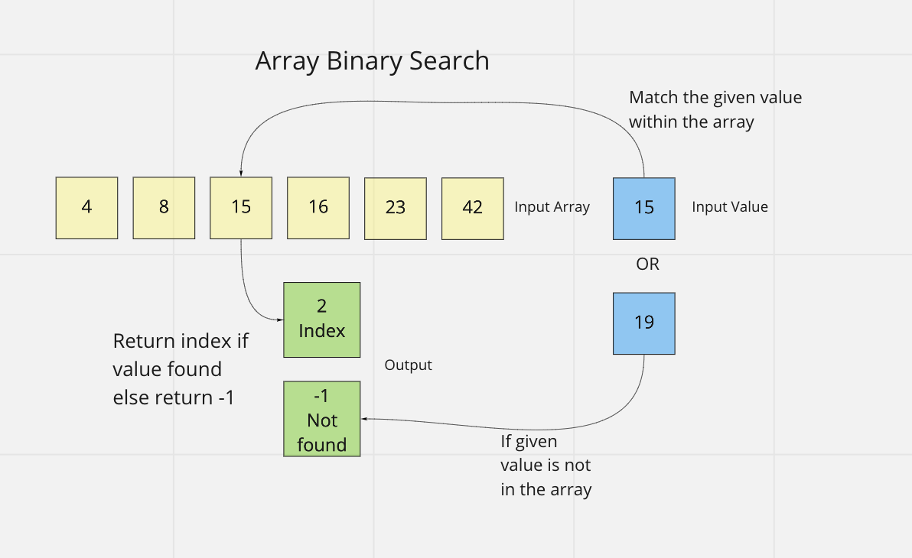

# Array Binary Search

This function takes in a numeric sorted array and a search key value as arguments and returns the index of the array element that equals the value of the search key. If the value is not found, the function returns -1.

## Inputs / Outputs

Input: `[[4, 8, 15, 16, 23, 42], 15`\
Output: `2`

## Algorithm

Start by defining two indexes, one that points at the beginning of the array and one that points at the last element. Next, we define an index that is equal to the sum of these indexes divided by two. This gives us the index to the middle of the array. If the desired value is greater than the middle value, we move the start index to the next element and calculate a new middle index. If the desired value is less than the middle value, we move the end index to the element before the middle index. We continue subdividing the array by moving the start and end index. Once the value is found, it's index should be the middle index, which we return. If the value is not found and the start and end indexes are equal, we return -1.

## Pseudocode

```plaintext
function BinarySearch takes in `arr` and 'val':

  declare startIndex <- 0;
  declare endIndex <- length of array minus 1;

  while startIndex <= endIndex:
    declare middleIndex <- startIndex + endIndex divided by two;
    compare element at middleIndex to val;
    if val = element at middleIndex
      return middleIndex
    if val is greater than element at middleIndex
      startIndex <- middleIndex + 1;
    if val is less than element at middleIndex
      endIndex <- middleIndex - 1;
  if loop ends without returning, return -1
```

## Visual


