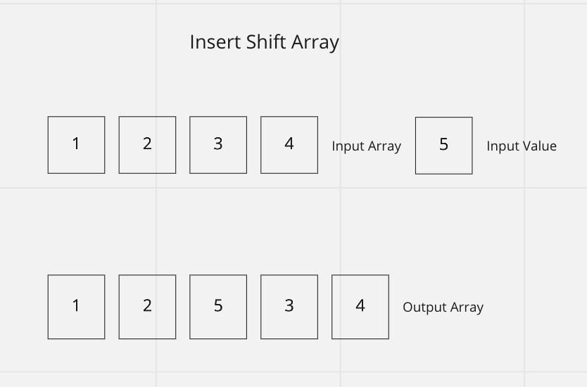

# Reverse Array

This function takes in an array and a value as an arguments and returns a new array containing the elements of the original array with the new value added at the moddle index.

## Inputs / Outputs

Input: `[2,4,6,-8], 5`\
Output: `[2,4,5,6,-8]`

## Algorithm

Starting at the beginning of the input array, we can move each element into the output array until we reach the middle of the array. At the middle of the array, we insert the passed in value. We then continue moving the elements of the original array into the new array following the newly inserted element.

- Use a for loop to iterate through the input array.
- For each item, copy to new array beginning at index 0.
- Stop at the middle index of the array and insert the new value.
- Next, continue copying the remaining elements of the input array into the new output array.

## Pseudocode

```plaintext
function insertShiftArray takes in `arr` and 'val':

  declare newArr;
  declare index <- 0;
  declare middle index <- length of arr divided by two;
  declare end <- arr length;


  while start >= end:
    push newArr <- arr[index];
    if index = middle index: push newArr <- val;
    continue push newArr <- arr[index];
    index = index + 1
```

## Actual Code

```javascript
const reverseArray = (arr, val) => {
  const newArr = [];
  const middle = Math.round(arr.length / 2);
  for (let i = arr.length - 1; i >= 0; i--) {
    if (i === middle) {
      newArr.push(val);
    } else {
      newArr.push(arr[i]);
    }
  }
  return newArr;
};
```

## Visual


