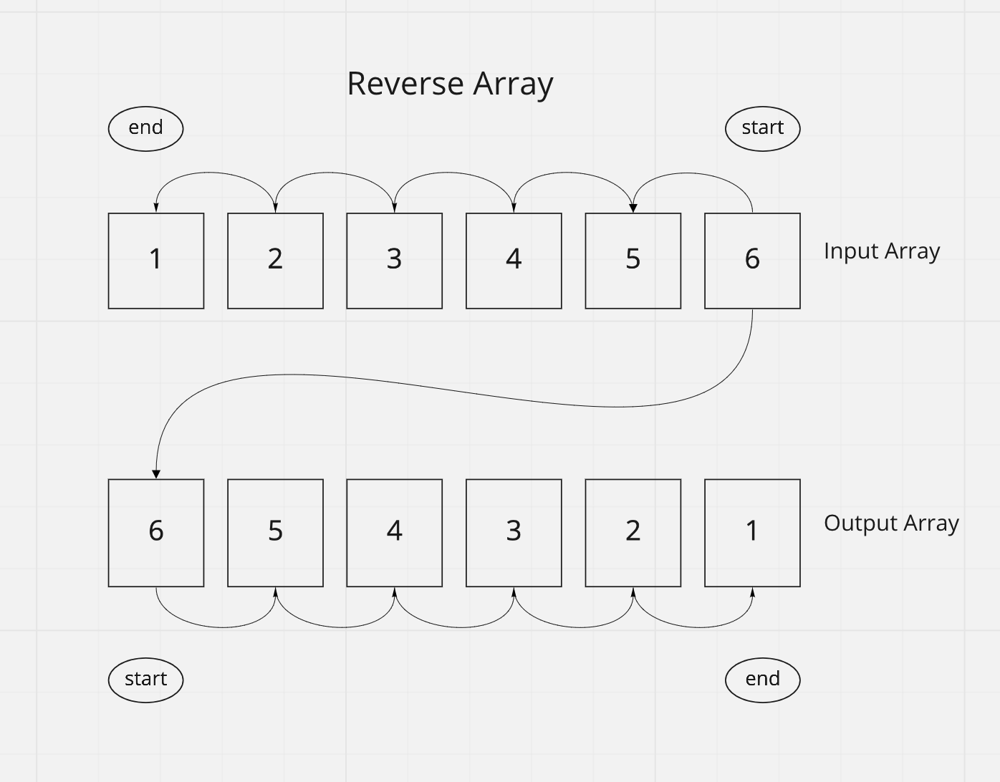

# Reverse Array

This function takes in an array as an argument and returns a new array containing the elements of the original array in reverse order.

## Inputs / Outputs

Input: `[1, 2, 3, 4, 5, 6]`\
Output: `[6, 5, 4, 3, 2, 1]`

## Algorithm

Starting at the end of the input array, we can move each element into the output array.

- Use a for loop to iterate through the input array.
- For each item, copy to new array beginning at index 0.
- Stop after the 0th item in the input array.

## Pseudocode

```plaintext
function reverseArray takes in `arr`:

  declare newArr;
  declare newArrIndex <- 0;
  declare start <- length of arr minus 1;
  declare end <- 0;


  while start >= end:
    newArr[newArrIndex] <- arr[start];
    start = start - 1;
    newArrIndex = newArrIndex + 1;
```

## Actual Code

[source](./array-reverse.js)

```javascript
const reverseArray = (arr) => {
  const newArr = [];
  let j = 0;
  for (let i = arr.length - 1; i >= 0; i--) {
    newArr[j] = arr[i];
    j++;
  }
};
```

## Visual


