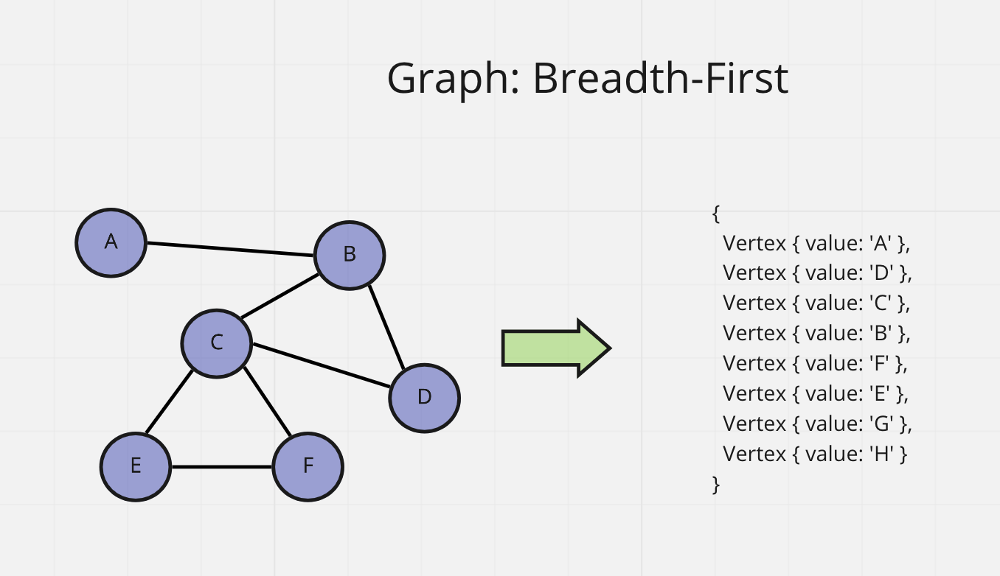

# Graph Breadth First

Code Challenge - Class 36: Graph Breadth First

## Challenge

Extend the Graph class implementation by adding a method that traverses the graph breadth first. Return and display a collection of nodes in the order they were visited.

```javascript
graph.breadthFirst(startVertex);
```

## Whiteboard Process



## Approach & Efficiency

Big O time complexity:

`graph.addVertex()` - O(1)
`graph.addDirectedEdge(startVertex, endVertex, weight = 0)` - O(1)
`graph.getNeighbors(vertex)` - O(n)
`graph.getNodes()` - O(1)
`graph.getSize()` - O(1)

## API

`graph.breadthFirst(startVertex);`

- Arguments: starting vertex
- Returns: Object of vertices
