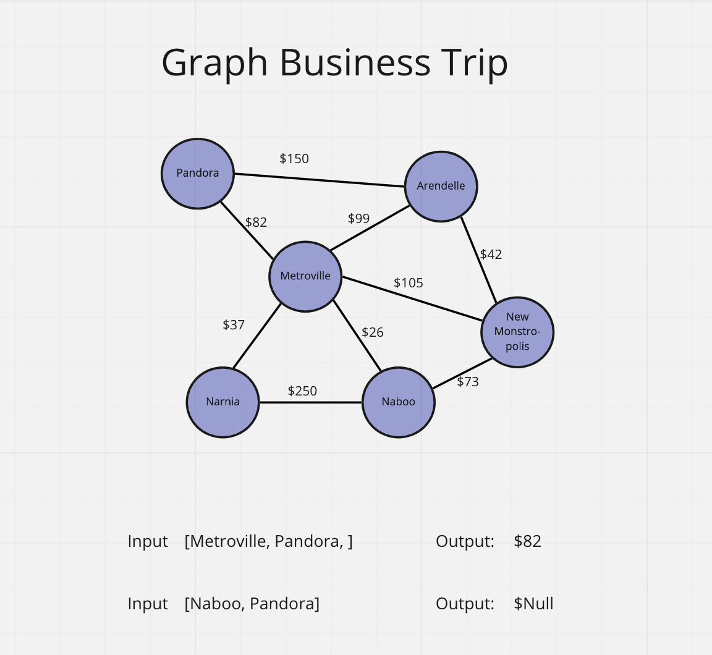

# graph-business-trip

Code Challenge - Class 37: graph-business-trip

## Challenge

Given a business trip itinerary, and an Alaska Airlines route map, is the trip possible with direct flights? If so, how much will the total trip cost be?

Write a function called business trip. It shoud take a graph and array of city names as parameters. It should return the trip's cost, or null if the trip is not possible.

```javascript
businessTrip(graph, array);
```

## Whiteboard Process



## Approach & Efficiency

Big O time complexity:

`businessTrip(graph, array);` - O(n)

## API

`businessTrip(graph, array);`

- Arguments: graph, array of city names
- Return: cost or null
