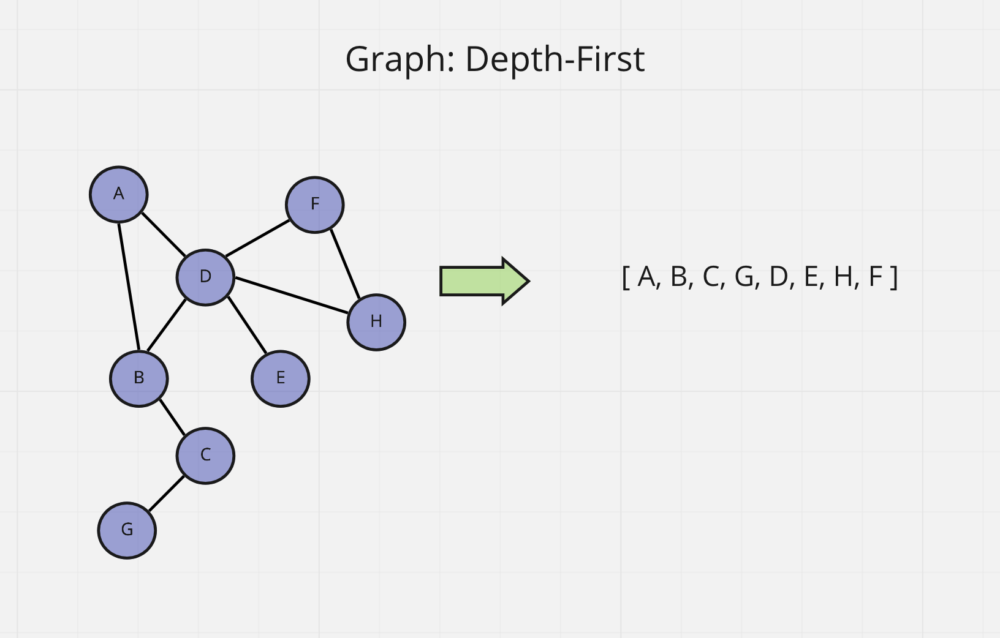

# graph-depth-first

Code Challenge - Class 38: graph-depth-first

## Challenge

Conduct a depth first preorder traversal on a graph

```javascript
depthFirst(graph, vertex);
```

## Whiteboard Process



## Approach & Efficiency

Big O time complexity:

`depthFirst(graph, vertex);` - O(n)

## API

`depthFirst(graph, vertex);`

- Arguments: graph, array of city names
- Return: cost or null
