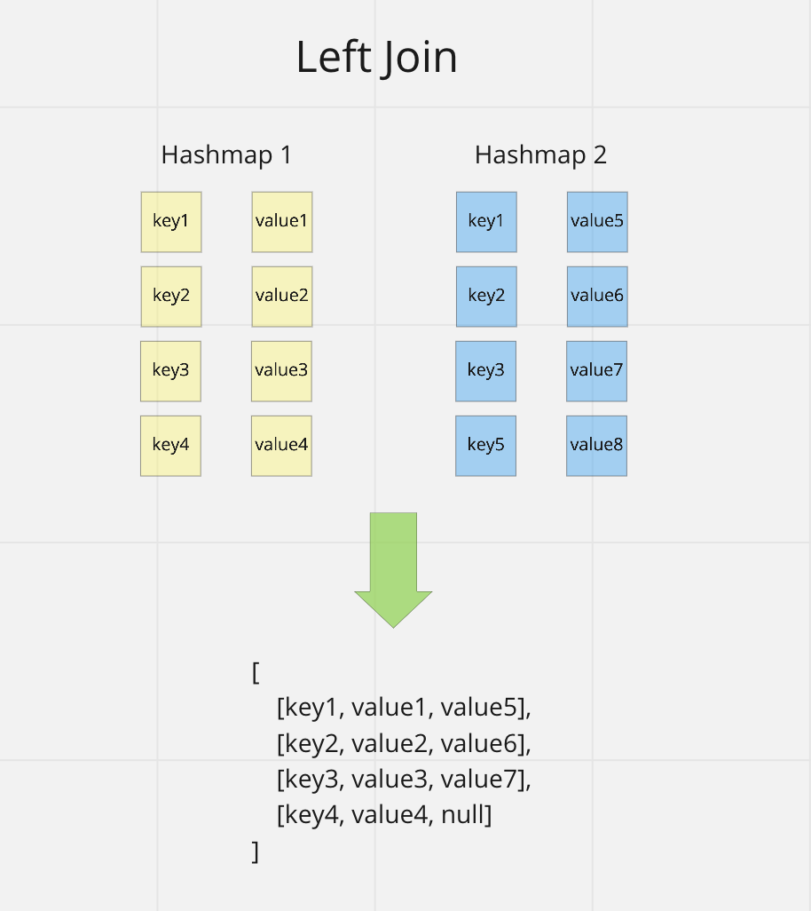

# Hashmap Left Join

Code Challenge - Class 33: Implement a simplified LEFT JOIN for 2 Hashmaps

## Challenge

Write a function that LEFT JOINs two hashmaps into a single data structure.

`leftJoin(map1, map2)`

## Approach & Efficiency

Big O:

time complexity: O(n)
space complexity: O(n)

## API

`leftJoin(map1, map2)`

- Arguments: two hash maps
  - The first parameter is a hashmap that has word strings as keys, and a synonym of the key as values.
  - The second parameter is a hashmap that has word strings as keys, and antonyms of the key as values.
- Return: The returned data structure that holds the results is up to you. It doesn’t need to exactly match the output below, so long as it achieves the LEFT JOIN logic

## Visual

