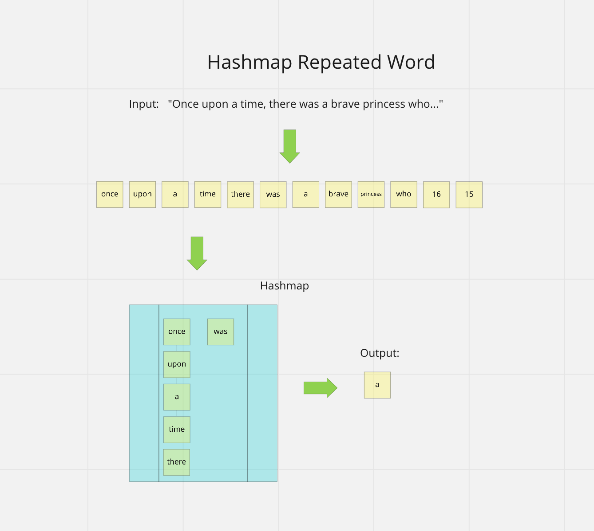

# Hashmap Repeated Word

Code Challenge - Class 31: Find the first repeated word in a book.

## Challenge

Write a function called repeated word that finds the first word to occur more than once in a string

`repeatedWord(string)`

## Approach & Efficiency

The first step is to use regex to remove all the punctuation from the string. Next, split the string at spaces and store the resulting words in an array. Iterate over the array, checking to see if each word is contained a newly created hash table. If the word is in the table, return the word. Otherwise, put the word in the table and continue. If the end of the array is reached and no word is found in the table, return 'no repeats.'

Big O:

time complexity: O(n)
space complexity: O(n)

## API

`repeatedWord(string)`

- Arguments: string
- Return: string

## Visual

