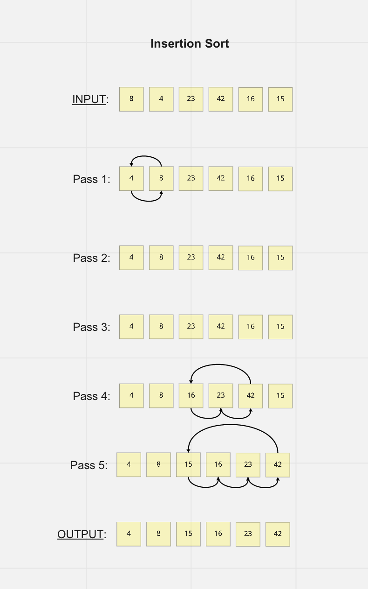

# Insertion Sort

Sorting algorithms are specialized algorithms used to sort lists of items into ascending order. Comparison sorts perform this task through comparison operations (e.g. <, >, =) that detemine which of the compared elements should occur before the other in the final sorted list. The Insertion Sort is a simple comparison sort that builds a sorted list behind the index as it iterates through the input.

The main benefits of the Insertion Sort are that it occurs in place, is adaptive, and is stable. In place means that no additional space needs to be allocated for the sort. Adaptive indicates that it works with lists that are already partially sorted. It is stable because it does not change the position of items that have the same value. The main drawback of the Insertion Sort is that it becomes increasingly inefficient as the size of the list grows.

Let us assume that the unsorted input list is provided as an arrray. The Insertion Sort begins at the second element of the array (index 1). It takes this value as the first "key", and compares its value with the first element. It then arranges these elements in ascending order. As the index increments to the next "key," a growing sorted subarray is left behind it. If the new key is larger than or equal to the previous value (the greatest value in the subarray), nothing happens and the index increments. If it is smaller, its correct position in the sorted subarray is determined by comparison and the value is inserted there.

As you can see, the Insertion Sort gets its name because, as it compares each value, it **_inserts_** the key into its correct position.

## Pseudocode

```plaintext
  InsertionSort(int[] arr)

    FOR i = 1 to arr.length

      int j <-- i - 1
      int temp <-- arr[i]

      WHILE j >= 0 AND temp < arr[j]
        arr[j + 1] <-- arr[j]
        j <-- j - 1

      arr[j + 1] <-- temp
```

## Trace



## Efficiency

**_Big O_**

As mentioned above, the Insertion Sort occurs in place and does not require additional space to be allocated. As such, its Big O space complexity is constant - O(1).

In its worst case scenario, the time complexity of the is quadratic. The comparisons can occur up to n(n - 1) times for a Big O of O(n^2).
