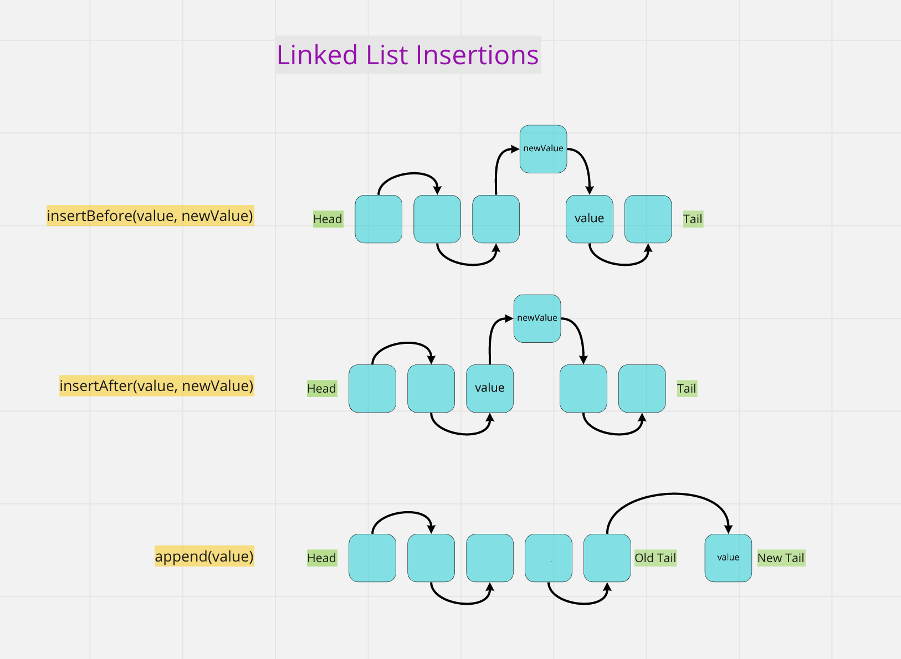

# Linked List Insertions

Code Challenge - Class 06: Linked List Insertions

## Challenge

Extend our `Linked List` implementation with the following methods:

```javascript
list.append(value);
list.insertBefore(value, newValue);
list.insertAfter(value, newValue);
```

## Whiteboard Process



## Approach & Efficiency

Big O time complexity

`list.append(value);` : O(n)
`list.insertBefore(value, newValue);` : O(n)
`list.insertAfter(value, newValue);` : O(n)

## Solution

```javascript
list.append(value);
```

```plaintext
- Arguments: value
- adds a new node with the given value to the end of the list
```

```javascript
list.insertBefore(value, newValue);
```

```plaintext
- Arguments: value, newValue
- adds a new node with the given new value immediately before the first node that has the value specified
```

```javascript
list.insertAfter(value, newValue);
```

```plaintext
- Arguments: value, newValue
- adds a new node with the given new value immediately after the first node that has the value specified
```
