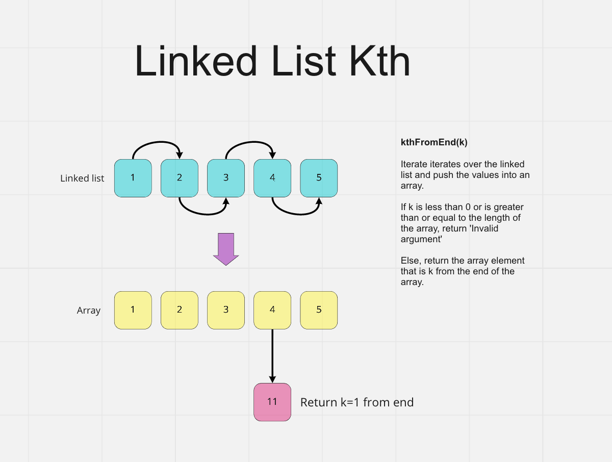

# Linked-List-Kth (Code Challenge: Class 07)

Code Challenge - Class 06: Linked List Insertions

## Challenge

Extend our `Linked List` implementation with the following method that returns the value contained by the node that is k (an integer) places from the tail of the linked list.

```javascript
list.kthFromEnd(k);
```

## Whiteboard Process



## Approach & Efficiency

Big O time complexity

`list.kthFromEnd(k);` : O(n)

## Solution

This solution iterates over the linked list, pushing the values into an array. If k is less than 0 or is greater than or equal to the length of the array, `Invalid argument` is returned. Otherwise, the method returns the array element that is `(arr.length -1) -k` from the end of the array.

```javascript
list.kthFromEnd(k);
```

```plaintext
- Argument: a number, k, as a parameter.
- Return the node’s value that is k places from the tail of the linked list.
```
