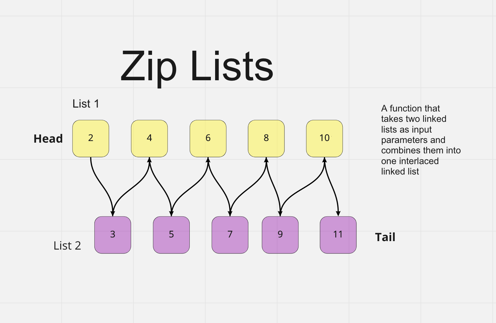

# Linked-List-Zip

Code Challenge - Class 08: Linked List Zip

## Challenge

Write a function that takes to linked lists as parameters and returns a new linked that contains the nodes of the arguments zipped together.

```javascript
zipLists(list1, list2);
```

## Whiteboard Process



## Approach & Efficiency

Big O time complexity

`zipLists;` : O(n)

## Solution

This solution iterates over the linked lists, creating a new linked list that consists of alternating nodes from the provided lists. If either list is empty, `'Cannot zip empty list'` is returned. Otherwise, the new list is returned. Neither argument is mutated.

```javascript
zipLists(list1, list2);
```

```plaintext
- Arguments: 2 linked lists
- Return: Linked List, zipped together such that if

  list1 = {1} -> {3} -> {2} -> NULL
  list2 = {5} -> {9} -> {4} -> NULL

  then

  newList = {1} -> {5} -> {3} -> {9} -> {2} -> {4} -> NULL
```
