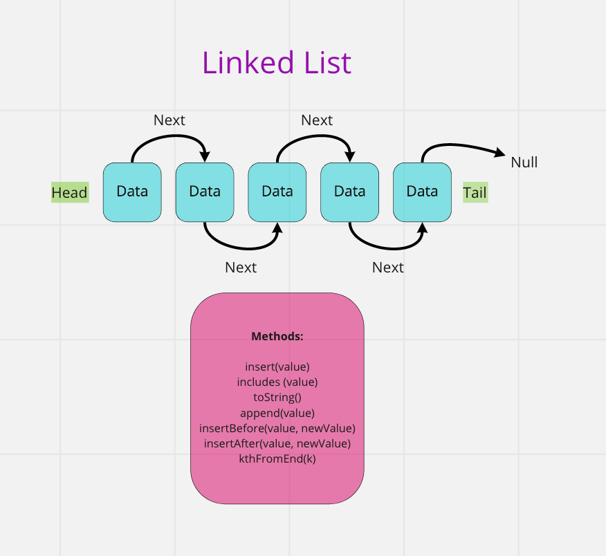

# Singly Linked List

Code Challenge: Class 06: Linked List Implementation

## Challenge

Implement a `Linked List` class in JavaScript. The class should contain six methods:

```javascript
list.insert(value);
list.includes(value);
list.toString();
list.append(value);
list.insertBefore(value, newValue);
list.insertAfter(value, newValue);
list.kthFromEnd(k);
```

## Approach & Efficiency

Iterative approach.

Big O: O(1)

## API

### Methods

```javascript
list.insert(value);
```

```plaintext
- Arguments: value
- Returns: nothing
- Adds a new node with that value to the head of the list with an O(1) Time performance.
```

```javascript
list.includes(value);
```

```plaintext
- Arguments: value
- Returns: Boolean
- Indicates whether that value exists as a Node’s value somewhere within the list.
```

```javascript
list.toString();
```

```plaintext
- Arguments: none
- Returns: a string representing all the values in the Linked List, formatted as:
  `{ a } -> { b } -> { c } -> NULL`
```

```javascript
list.append(value);
```

```plaintext
- Arguments: value
- adds a new node with the given value to the end of the list
```

```javascript
list.insertBefore(value, newValue);
```

```plaintext
- Arguments: value, newValue
- adds a new node with the given new value immediately before the first node that has the value specified
```

```javascript
list.insertAfter(value, newValue);
```

```plaintext
- Arguments: value, newValue
- adds a new node with the given new value immediately after the first node that has the value specified
```

```javascript
list.kthFromEnd(k);
```

```plaintext
- Argument: a number, k, as a parameter.
- Return the node’s value that is k places from the tail of the linked list
```

## Visual


