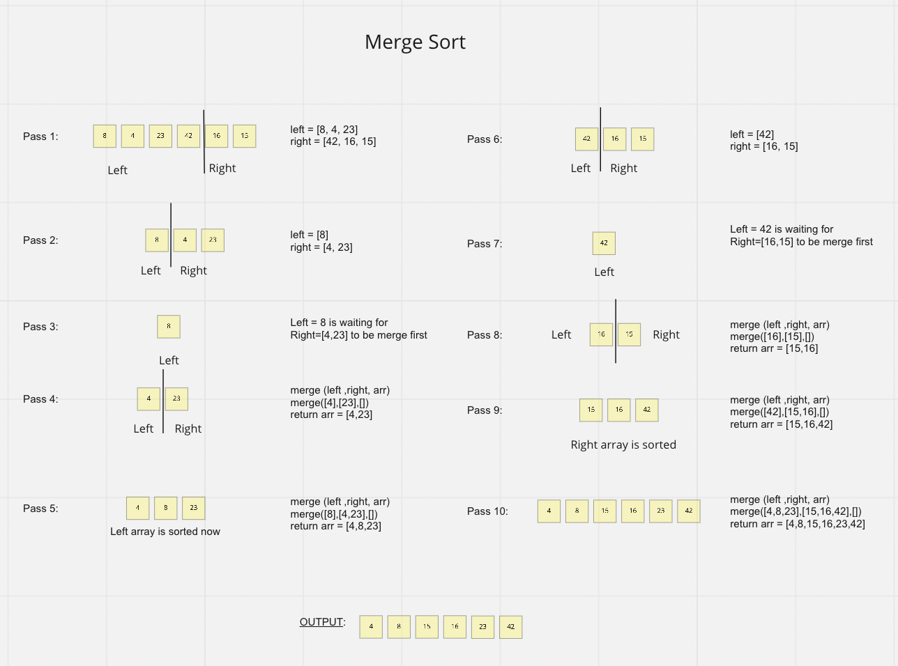

# Merge Sort

Sorting algorithms are specialized algorithms used to sort lists of items into ascending order. Comparison sorts perform this task through comparison operations (e.g. <, >, =) that detemine which of the compared elements should occur before the other in the final sorted list. The Merge Sort is a comparison sort that uses a divide and conquer strategy. It recursively divides an input list into sublists until each contains only one element. It then uses comparison to merge these sublists into a single sorted list.

Let us assume that the unsorted input list is provided as an arrray. The Merge Sort divides the array in down the middle into 'left' and 'right' subarrays. It then recursively divides each subarray until all subarrays consist of a single element (`array.length <= 1`). It does this to take advantage of the fact that an array of one is technically sorted. Next, a merge algorithm is recursively called on the subarrays that uses comaprison to merge the elements into a sorted array. It is important to note that this merge algorithm relies on the fact that its input subarrays are in a sorted order to produce the correct result.

As you can see, the Merge Sort gets its name because it divides a list into its individual elements and then ***merges*** them back into a sorted list.

## Pseudocode

```plaintext
ALGORITHM Mergesort(arr)
    DECLARE n <-- arr.length

    if n > 1
      DECLARE mid <-- n/2
      DECLARE left <-- arr[0...mid]
      DECLARE right <-- arr[mid...n]
      // sort the left side
      Mergesort(left)
      // sort the right side
      Mergesort(right)
      // merge the sorted left and right sides together
      Merge(left, right, arr)

ALGORITHM Merge(left, right, arr)
    DECLARE i <-- 0
    DECLARE j <-- 0
    DECLARE k <-- 0

    while i < left.length && j < right.length
        if left[i] <= right[j]
            arr[k] <-- left[i]
            i <-- i + 1
        else
            arr[k] <-- right[j]
            j <-- j + 1

        k <-- k + 1

    if i = left.length
       set remaining entries in arr to remaining values in right
    else
       set remaining entries in arr to remaining values in left
```

## Trace



## Efficiency

**_Big O_**

Space
The Merge Sort creates as many subarrays as the number of elements in the imput array. As a result, its Big O space complexity O(n).

Time
The recursive subdivision of the input array into its individaul elements has a Big O of O(n) The time complexity of the merge algorithm is O(nlog(n)). The means that the Big O time complexity for the Merge Sort is O(nlog(n).
