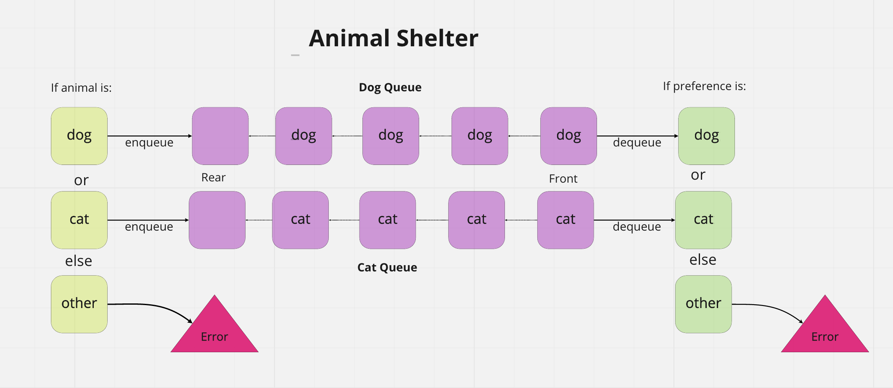

# AnimalShelter (stack-queue-animal-shelter)

## Challenge Summary

- Create a class called AnimalShelter which holds only dogs and cats.
- The shelter operates using a first-in, first-out approach.

## Whiteboard Process

## Approach & Efficiency

Big O time complexity:

`AnimalShelter.enqueue(animal)` - O(1)
`AnimalShelter.dequeue(pref)` - O(1)

## Solution

This solution utilizes two queues, a DogQueue and a CatQueue. An `AnimalShelter.enqueue(animal)` adds the passed animal ('dog' or 'cat') to its respective queue. If the animal is another type an exception 'We only take dogs and cats' is raised. When `AnimalShelter.dequeue(pref)` is called, the method verifies that a dog or cat is requested. If not, 'null' is returned. Otherwise, the requested animal is dequeued and returned. If there are no animals in the shelter of the requested type, 'Empty queue' is returned. In this manner, animals are given homes on a first-in first-out basis.

`AnimalShelter.enqueue(animal)`

- Arguments: `animal`
- `animal` can be either a dog or a cat object.

`AnimalShelter.dequeue(pref)`

- Arguments: pref
- `pref` can be either "dog" or "cat"
- Return: either a dog or a cat, based on preference.
- If pref is not "dog" or "cat" then return null.
