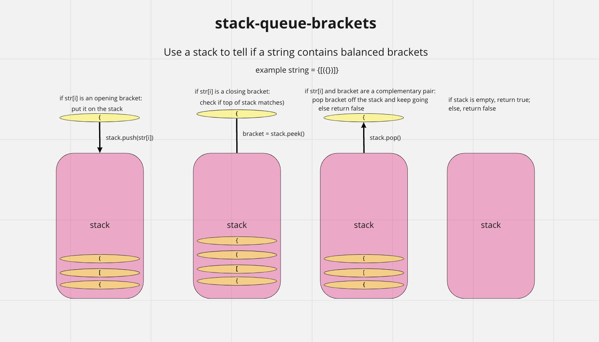

# validateBrackets(string) -- stack-queue-brackets

## Challenge Summary

- Write a function to validate whether or not the brackets in a string are balanced

| Argument                | Return |
| ----------------------- | ------ |
| {}                      | TRUE   |
| {}(){}                  | TRUE   |
| ()[[Extra Characters]]  | TRUE   |
| (){}[[]]                | TRUE   |
| {}{Code}[Fellows](<()>) | TRUE   |
| [({}]                   | FALSE  |
| (](                     | FALSE  |
| {(})                    | FALSE  |

## Whiteboard Process

## Approach & Efficiency

Big O time complexity:

`valdidateBrackets(string)` - O(n)

## Solution

This solution iterates over the string. If the character is an openening bracket, it is pushed onto a stack. If it is a closing bracket, it is compared to the value on the top of the stack. If they match, the iteration contnues. If not, false is returned. After the entire string is analyzed, the stack is checked. If the stack is empty, the function returns true, otherwise it returns false.

`validateBrackets(string)`

- Arguments: string
- Return: boolean representing whether or not the brackets in the string are balanced
