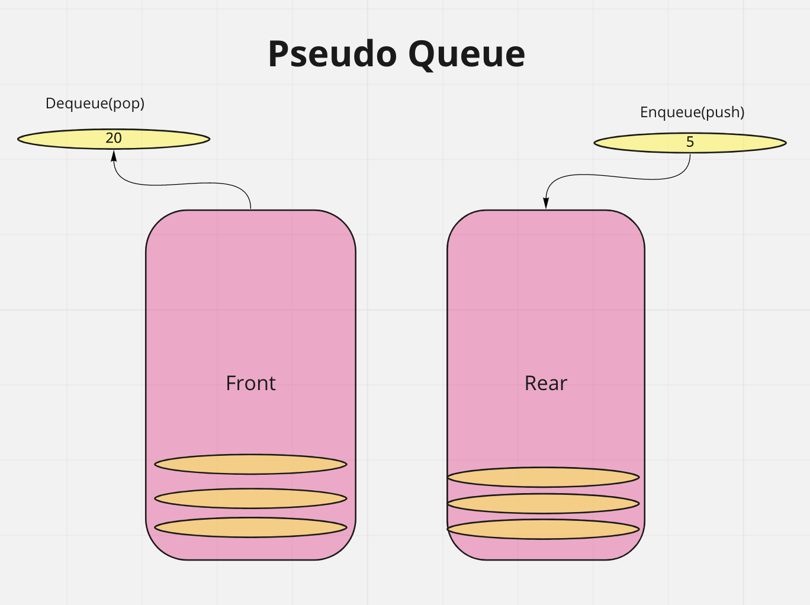

# PseudoQueue

## Challenge Summary

- Create a new class called pseudo queue.
  - Do not use an existing Queue.
  - Instead, this PseudoQueue class will implement our standard queue interface (the two methods listed below),
  - Internally, utilize 2 Stack instances to create and manage the queue

## Whiteboard Process

## Approach & Efficiency

Big O time complexity:

`PseudoQueue.enqueue()` - O(1)
`PseudoQueue.dequeue()` - O(n)

## Solution

This method utilizes two stacks, a Front stack and a Rear stack. An `enqueue` pushes the passed value onto the top of the Rear stack. When `dequeue` is called, the method first checks to see if the Front stack is empty. If not, the top of the Front stack is popped off and returned. If the Rear is also empty, an 'Empty queue' exception is raised. Otherwise, the contents of the Rear stack are popped off and pushed onto the Front Stack. The top of the Front stack is finally popped off and returned. In this manner, the first-in first-out behavior of a queue is maintained.

`PseudoQueue.enqueue(value)`

- Arguments: value
- Inserts value into the PseudoQueue, using a first-in, first-out approach.

`PseudoQueue.dequeue()`

- Arguments: none
- Extracts a value from the PseudoQueue, using a first-in, first-out approach.h
