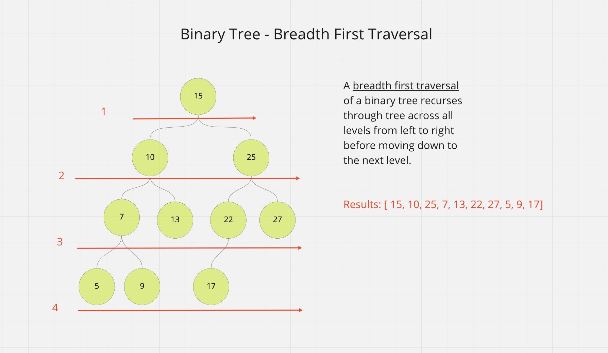

# tree-breadth-first

Code Challenge - Class 17: Breadth-first Traversal

## Challenge

Extend the binary tree implementation by adding a method that traverses the input tree and returns an array of the node values using a breadth-first approach.

```javascript
tree.breadthFirst();
```

## Whiteboard Process



## Approach & Efficiency

Big O time complexity

`tree.findMaxValue();` : O(n)

## Solution

Use recursion to traverse the entire tree. For every node, return the greater of either the current node value, the left node value, or the right node value.

```javascript
tree.breadthFirst();
```

```plaintext
- Arguments: none
- Return: list of all values in the tree, in the order they were encountered
```
