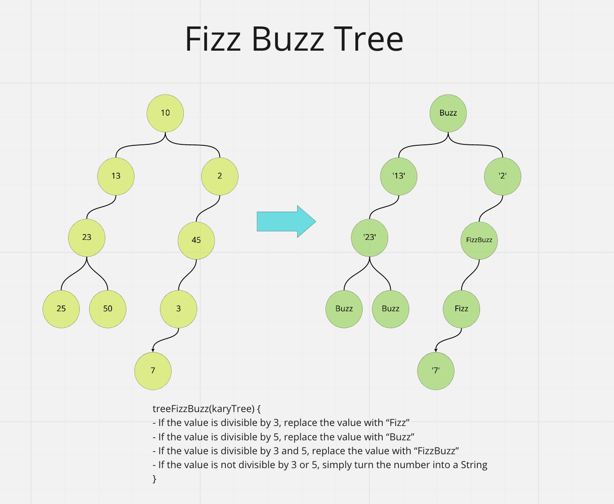

# tree-fizz-buzz

Code Challenge - Class 18: FizzBuzz Tree

## Challenge

Conduct “FizzBuzz” on a k-ary tree while traversing through it to create a new tree. Determine whether or not the value of each node is divisible by 3, 5 or both. Create a new tree with the same structure as the original, but the values modified as follows:

- If the value is divisible by 3, replace the value with “Fizz”
- If the value is divisible by 5, replace the value with “Buzz”
- If the value is divisible by 3 and 5, replace the value with “FizzBuzz”
- If the value is not divisible by 3 or 5, simply turn the number into a String.

```javascript
treeFizzBuzz(karyTree);
```

## Whiteboard Process



## Approach & Efficiency

Big O time complexity

`treeFizzBuzz(karyTree);` : O(n)

## Solution

Use recursion to traverse the entire tree. For every node, return the greater of either the current node value, the left node value, or the right node value.

```javascript
treeFizzBuzz();
```

```plaintext
- Arguments: Arguments: k-ary tree
- Return: new k-ary tree
```
