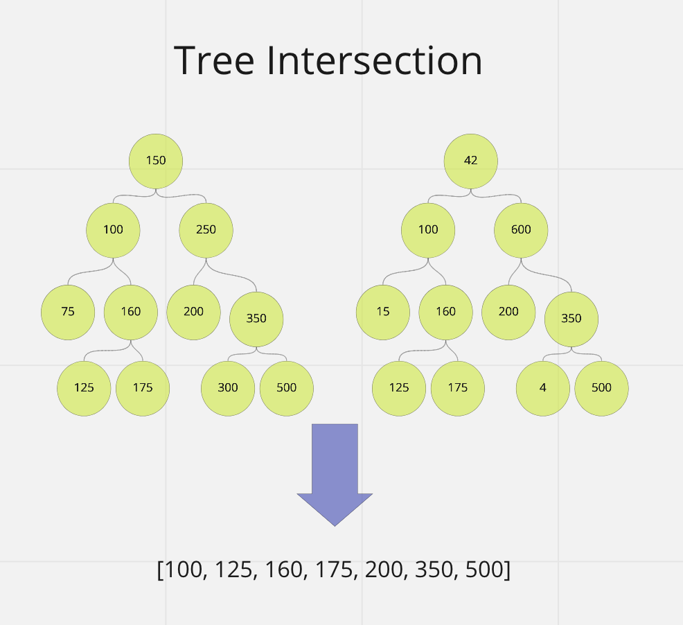

# Tree Intersection

Code Challenge - Class 32: Find common values in 2 binary trees.

## Challenge

Write a function called treeIntersection that finds the values found in two binary trees.

`treeIntersection(tree1, tree2)`

## Approach & Efficiency

Big O:

time complexity: O(n)
space complexity: O(n)

## API

`treeIntersection(tree1, tree2)`

- Arguments: two binary trees
- Return: array

## Visual

